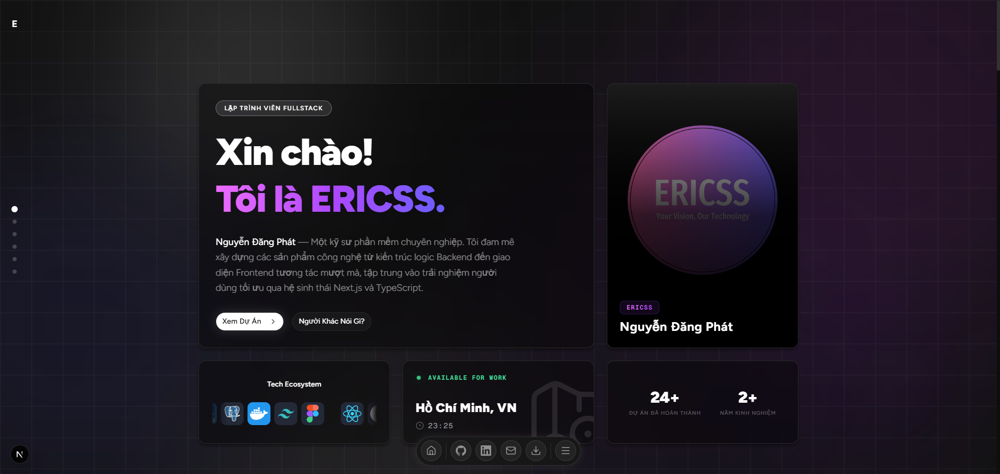

<br />
<div align="center">
  

  <h1 align="center">Modern Fullstack Developer Portfolio 🚀</h1>

  <p align="center">
    Một trang web cá nhân Premium Dark Mode, tích hợp Blog và Form liên hệ thực tế, được xây dựng với các công nghệ Web hiện đại bậc nhất năm 2026.
    <br />
    <br />
    <a href="#-tính-năng-nổi-bật"><strong>Khám phá tính năng »</strong></a>
    <br />
    <br />
  </p>
</div>

## 🌟 Tính năng nổi bật

- **Tốc độ tải trang cực đỉnh**: Ứng dụng sức mạnh của **Next.js 16 (App Router)** và **React 19**, mang lại trải nghiệm Server-Side Rendering (SSR) siêu nhanh.
- **Giao diện Glassmorphism đỉnh cao**: Được thiết kế tỉ mỉ với **Tailwind CSS v4** kết hợp cùng các hiệu ứng chuyển động cực kì mượt mà của **Framer Motion** (`motion/react`).
- **Liên hệ Server-Side tự động**: Tích hợp form liên hệ chạy ngầm bằng **Server Actions** và **Nodemailer**, gửi thư thẳng về Gmail cá nhân an toàn mà không bị giới hạn quota của dịch vụ bên thứ ba. Nhận phản hồi UI tức thì bằng **Sonner Toast**.
- **Responsive Navigation**: Hệ thống menu dock phong cách macOS ở dưới đáy màn hình cực kì tiện lợi, đi kèm với Fullscreen Menu xịn xò cho trải nghiệm di động.
- **Theo dõi hiệu năng (Analytics)**: Cài đặt sẵn `@vercel/analytics` và `@vercel/speed-insights` để theo dõi lượng truy cập và chỉ số Core Web Vitals thời gian thực.

## 🛠️ Công nghệ sử dụng (Tech Stack)

| Hạng mục        | Công nghệ |
| ------------- |:-------------|
| **Core Framework**| Đầu tàu là **Next.js 16** (Typescript) chạy trên App Router. |
| **Giao diện (UI)**| Được dựng lên từ **Tailwind CSS v4**, **Shadcn UI**, **Radix UI**. |
| **Hiệu ứng/Hoạt ảnh**| **Motion/react** (Framer Motion thế hệ mới), CSS Animation tuỳ biến. |
| **Icons & Font**| **Lucide React**, **Hugeicons**, Font Tối ưu hoá mặc định qua `next/font`. |
| **Mail & Backend**| Giao tiếp SMTP bằng **Nodemailer**, xử lý dữ liệu qua Form Actions của **React 19**. |
| **Triển khai (Deploy)**| Môi trường máy chủ **Vercel**. |

## 🚀 Hướng dẫn cài đặt (Local Development)

Làm theo các bước sau để sao chép và tự chạy phiên bản portfolio này trên máy của bạn:

1. **Clone dự án & Cài đặt thư viện:**
   ```bash
   git clone https://github.com/nguyenphat006/fullstack-portfolio.git
   cd fullstack-portfolio
   npm install
   ```

2. **Cấu hình Biến môi trường (Environment Variables):**  
   Tạo file `.env.local` ở ngay ngoài cùng dự án và điền thông tin sau (Dùng cho tính năng Gửi Mail liên hệ):
   ```env
   # Email Gmail nhận thư và gửi thư
   GMAIL_USER="email-cua-ban@gmail.com"
   
   # Mật khẩu ứng dụng của Gmail (Dài 16 ký tự, viết liền không dấu cách)
   # Sinh ra tại: Bảo mật Google > Mật khẩu ứng dụng
   GMAIL_APP_PASSWORD="abcdefghijklmnop"
   ```

3. **Khởi động Local Server:**
   ```bash
   npm run dev
   ```
   Sau đó mở trình duyệt và truy cập: [http://localhost:3000](http://localhost:3000).

## 📂 Kiến trúc dự án (Directory Structure)
- `src/app/`: File định tuyến các trang (Trang chủ, `/blog`, `/projects`) và cấu hình Layout gốc.
- `src/components/modules/`: Cấu trúc UI dành riêng cho từng trang lớn (Vd: Module `home` chứa code các khối hiển thị trang chủ).
- `src/components/shared/`: Layout dùng chung, footer, navigation dock toàn cục và các UI Element tái sử dụng.
- `src/components/ui/`: File gốc của các ShadCN/Radix Component được CLI sinh ra (`button`, `tooltip`, v.v).
- `src/actions/`: Logic chạy phí máy chủ cho Next.js Server Actions (Vd: `contact.ts` để gửi mail).
- `src/config/`: Định nghĩa các cấu hình metadata, navigation, đường dẫn trung tâm.

## 📝 Tuỳ biến nội dung
Bạn có thể dễ dàng thay đổi thông tin cá nhân của mình bằng cách chỉnh sửa file `constants.ts` nằm trong thư mục của từng trang (`src/components/modules/home/constants.ts`). Tất cả các component UI đều được viết sạch sẽ để tuỳ biến tái sử dụng vô hạn!
